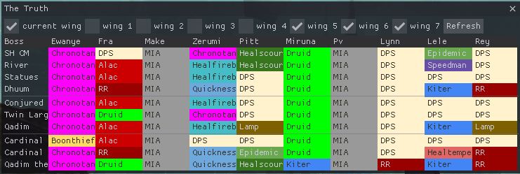
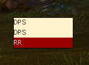

# The Truth™ Plugin

A Guild Wars 2
 
## Installation
Make sure arcdps is installed. If arcdps is not installed, this plugin is simply not loaded and does nothing.  
Download the latest version from [github releases](https://github.com/pv42/the-truth-plugin/releases/latest).  
Then put the .dll file into the same folder as arcdps (normally `<Guild Wars 2>/bin64`).  
To disable, just remove the .dll or move it to a different folder.
If you use arcdps plugin manager install into `<Guild Wars 2>/addons/thetruth-settings.json`.

## Quickstart
set up your own name:
- open arcdps settings (Shift+Alt+T by default)
- click on The Truth and then Settings
- in the Settings window set the "own name" field to the name that is used for you in the google sheet  

Visibility
- by default a compleate roles roster is displayed in the Lions Arch Aerodrome, this can be toggled with Shift+Alt+R
- your own roles are also displayed on raid day in the raid wing itself, this can be changed in the settings

## Features
Fetches raid roles from an Google Spreadsheet and displays them in games.
- compleate roster with all roles and all people with selectable raid wings

- small UI showing own roles for the current raid wing

- optinal colors based on the conditional formationg of the google sheet
- displaying information based on the current map you are in
- optinal hiding based on weekday
- configurable access to the google sheet

## Setting up the google sheet
The google sheet must be shared by link (everyone with the link can read it).
The id of the google sheet is the long cryptic string in the url for exaple for `https://docs.google.com/spreadsheets/d/19AEbyOVnXCzTlVmmKROu7aHLn9uYN7JzjLCNh7yE9uc/edit#gid=203977829` the id would be `19AEbyOVnXCzTlVmmKROu7aHLn9uYN7JzjLCNh7yE9uc`. The names range is the cell area where the names are in the google sheet. This must be a vertical range. `For example A2:A11.` If the roles are not stored in the first table of the google sheet the name must be specified like `'Raid Role'!A2:A11`. The wing .. roles ranges specify the cells in the google sheet where the roles are stored. These must be names vertical and boses horizontal. The wing .. header ranges specify where the encouncer names are stored for each wing. These must be horizontally stored. The header ranges are optional. Note that the google sheet id only updates when the game is restarted and the ranges are only updated when the data is refreshed (Button in the full roster UI).

## Troubleshooting
If the DLL is not loaded (options do not show up), make sure, that you have installed the latest C++ 2015-2019 Redistributable.
You can download the latest Redistributable from [Microsofts download page](https://support.microsoft.com/en-gb/help/2977003/the-latest-supported-visual-c-downloads).
Please use the version "Visual Studio 2015, 2017 and 2019".  
If you have problems, that your settings are reset on each startup, delete the file `<GW2>/addons/.json`. This will reset all your settings.

## Contact
For any errors, feature requests and questions, simply open a new issue here or write pv42#6061 on discord.

## Developer notes
Build using Microsoft Visual Studio 2019. Requires cpr, best installed using vcpkg:
```git clone https://github.com/Microsoft/vcpkg
./vcpkg integrate install
./vcpkg install cpr:x64-windows-static-md
```
Otherwise a google sheets api key is required place it into api_key.h like this:
```
#define GOOGLE_API_KEY "1234567890-abc-defghijklmnopqrst"
```

## LICENSE

This project is licensed with the MIT License.
The Truth is not an registered trade mark.

### Dear ImGui
[Dear ImGui](https://github.com/ocornut/imgui) is also licensed with the MIT License and included as git submodule to this project.

### json
[json](https://github.com/nlohmann/json) is a json library created by nlohmann and licensed with the MIT License. It is included into this project with a single file [json.hpp](/json.hpp).

### cpr
[cpr](https://github.com/whoshuu/cpr) is a http library, that is licensed with the MIT License. It is included with vcpkg and itself has dependencies.
